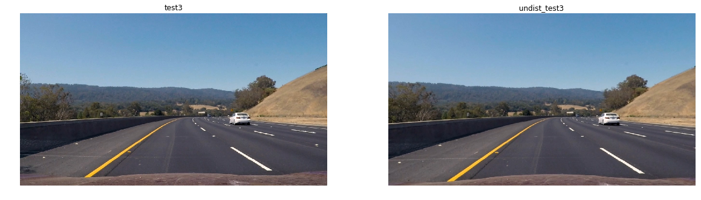
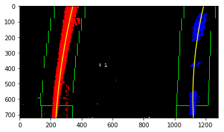

## Writeup Template

### You can use this file as a template for your writeup if you want to submit it as a markdown file, but feel free to use some other method and submit a pdf if you prefer.

**Advanced Lane Finding Project**

The goals / steps of this project are the following:

* Compute the camera calibration matrix and distortion coefficients given a set of chessboard images.
* Apply a distortion correction to raw images.
* Use color transforms, gradients, etc., to create a thresholded binary image.
* Apply a perspective transform to rectify binary image ("birds-eye view").
* Detect lane pixels and fit to find the lane boundary.
* Determine the curvature of the lane and vehicle position with respect to center.
* Warp the detected lane boundaries back onto the original image.
* Output visual display of the lane boundaries and numerical estimation of lane curvature and vehicle position.


## [Rubric](https://review.udacity.com/#!/rubrics/571/view) Points

All code is in [run.ipynb](./run.ipynb).

### Camera Calibration

#### 1. Briefly state how you computed the camera matrix and distortion coefficients. Provide an example of a distortion corrected calibration image.

I start by preparing "object points", which will be the (6, 9, 3) coordinates of
the chessboard corners in the world. Here I am assuming the chessboard is fixed
on the (6, 9) plane at z=0, such that the object points are the same for each
calibration image. Thus, `objp` is just a replicated array of coordinates, and
`objpoints` will be appended with a copy of it every time I successfully detect
all chessboard corners in a test image. `imgpoints` will be appended with the
(6, 9) pixel position of each of the corners in the image plane with each
successful chessboard detection.

I then used the output `objpoints` and `imgpoints` to compute the camera
calibration and distortion coefficients using the `cv2.calibrateCamera()`
function. I also used `cv2.getOptimalNewCameraMatrix` to get a optimized camera
matrix. I applied this distortion correction to the test image using the
`cv2.undistort()` function and obtained this result:


### Pipeline (single images)

#### 1. Provide an example of a distortion-corrected image.

To demonstrate this step, I will describe how I apply the distortion correction
to one of the test images like this one: 



#### 2. Describe how (and identify where in your code) you used color transforms, gradients or other methods to create a thresholded binary image.  Provide an example of a binary image result.

I used a combination of color and gradient thresholds to generate a binary image.

```python
    if s_thresh is None:
        s_thresh = (170, 255)
    if sx_thresh is None:
        sx_thresh = (20, 100)
        
    # Threshold x gradient
    sxbinary = np.zeros_like(scaled_sobel)
    sxbinary[(scaled_sobel >= sx_thresh[0]) & (scaled_sobel <= sx_thresh[1])] = 1
                    
    # Threshold color channel
    s_binary = np.zeros_like(s_channel)
    s_binary[(s_channel >= s_thresh[0]) & (s_channel <= s_thresh[1])] = 1
```
Example:


#### 3. Describe how (and identify where in your code) you performed a perspective transform and provide an example of a transformed image.

The code for my perspective transform includes a function called `warper()`

```python
def warp(img):
    img_size = (img.shape[1], img.shape[0])
    
    # LR, LF, RF, RR  
    src = np.float32([
        [342, 627],
        [603, 453],
        [708, 453],
        [990, 627],
    ])
    
    dst = np.float32([
        [200, 710],
        [200, 0],
        [1080, 0],
        [1080, 710],
    ])
    
    M = cv2.getPerspectiveTransform(src, dst)
    Minv = cv2.getPerspectiveTransform(dst, src)

    warped = cv2.warpPerspective(img, M, img_size , flags=cv2.INTER_LINEAR)
    return warped, M, Minv
```

The `warper()` function takes as inputs an image (`img`), as well as source
(`src`) and destination (`dst`) points. I chose the hardcode the source and
destination points.

| Source          | Destination     |
| :-------------: | :-------------: |
| 342, 627        | 200, 710        |
| 603, 453        | 200, 0          |
| 708, 453        | 1080, 0         |
| 990, 627        | 1080, 710       |

Example:


#### 4. Describe how (and identify where in your code) you identified lane-line pixels and fit their positions with a polynomial?

Then I followed the lecture to use 9 windows to figure out the lane line.



#### 5. Describe how (and identify where in your code) you calculated the radius of curvature of the lane and the position of the vehicle with respect to center.

After converting pixels to meters, I used `numpy.ployfit` to find the polynomials. 

#### 6. Provide an example image of your result plotted back down onto the road such that the lane area is identified clearly.

```python

def map_lane(undist_img, binary_warped, left_fitx, right_fitx):
    ysize, xsize = binary_warped.shape[:2]
    ploty = np.linspace(0, ysize - 1, ysize)
    warp_zero = np.zeros_like(binary_warped).astype(np.uint8)
    color_warp = np.dstack((warp_zero, warp_zero, warp_zero))

    pts_left = np.array([np.transpose(np.vstack([left_fitx, ploty]))])
    pts_right = np.array([np.flipud(np.transpose(np.vstack([right_fitx, ploty])))])
    pts = np.hstack((pts_left, pts_right))

    cv2.fillPoly(color_warp, np.int_([pts]), (0,255, 0))
    newwarp = cv2.warpPerspective(color_warp, Minv, (xsize, ysize)) 
    result = cv2.addWeighted(undist_img, 1, newwarp, 0.3, 0)

    x_left_pix = left_fit[0]*(y_eval**2) + left_fit[1]*y_eval + left_fit[2]
    x_right_pix = right_fit[0]*(y_eval**2) + right_fit[1]*y_eval + right_fit[2]
    return result
```


---

### Pipeline (video)

#### 1. Provide a link to your final video output.  Your pipeline should perform reasonably well on the entire project video (wobbly lines are ok but no catastrophic failures that would cause the car to drive off the road!).

Here's a [link to my video result](./project_video_output.mp4)

---

### Discussion

#### 1. Briefly discuss any problems / issues you faced in your implementation of this project.  Where will your pipeline likely fail?  What could you do to make it more robust?

When processing each image, I didn't take adavange of the lane position from the previous image. So speed performance is slow.
